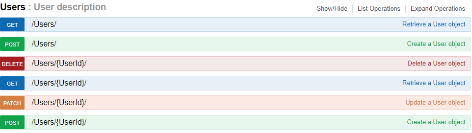
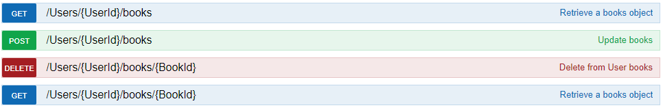
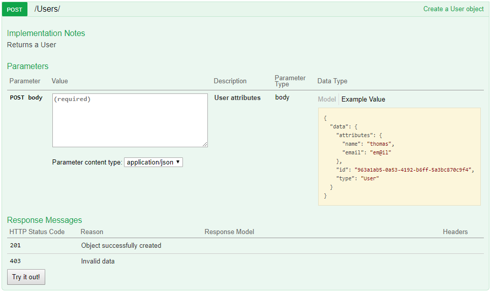

# Auto-generating Swagger Specifications with Python

A couple of years ago I had to implement a system monitoring app using the nutanix web api. This was the first time I was introduced to the swagger UI and I found it a really convenient way to debug and document web services.
Later, when asked to provide documentation for a different project, I took to swagger and started implementing a specification. Like most of today's webservices, the API endpoints for this project provided CRUD functionality: create, read, update, delete operations to a database backend.
A lot of the information that needed to be described in the specification was already implicitly coded into the application, so instead of writing down the definitions I decided to generate the specification using the available application semantics.

This was a python project using the flask-restful REST implementation with the SQLAlchemy ORM, so the idea was to extract database object schemas from the SQLAlchemy class declarations and the flask-restful endpoint definitions to generate the swagger specification.
This worked out very well and I’ve since improved the implementation and functionality and made the project available as an open source python-pip package: [safrs](https://github.com/thomaxxl/safrs).

I have created a small [example script](https://github.com/thomaxxl/safrs/blob/master/examples/demo_relationship.py) To demonstrate the package's functionality. 
Running this small script will expose the two classes (Users and Books) as REST endpoints, a running.


```python
class User(SAFRSBase, db.Model):
    '''
        description: User description
    '''
    __tablename__ = 'Users'
    id = Column(String, primary_key=True)
    name = Column(String, default='')
    email = Column(String, default='')
    books = db.relationship('Book', back_populates="user", lazy='dynamic')
```

This simple class definition will automatically produce a swagger specification and [jsonapi](http://jsonapi.org/) routes:


The software can also detect and expose database relationships, the “books” relationship defined in the User class from the example creates following endpoints



The json data expected by the API will also be automatically generated by using a sample object instance:



It's also possible for developers to describe additional swagger specification details as 
yaml-encoded comments (eg. the "description" key in the User class will be parsed and used as the description in the UI).


